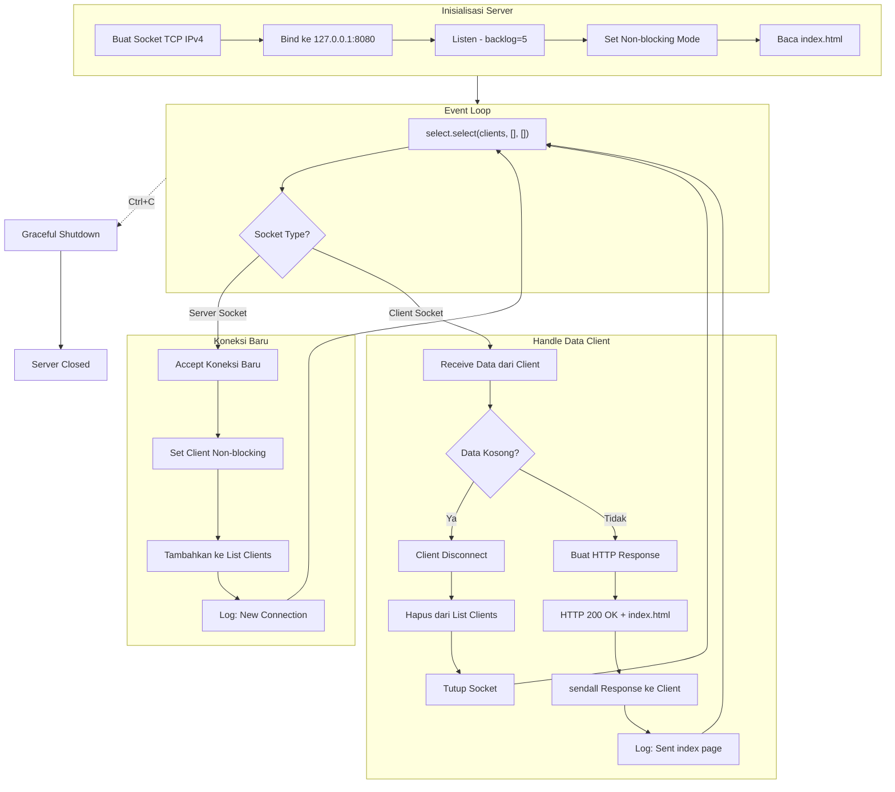
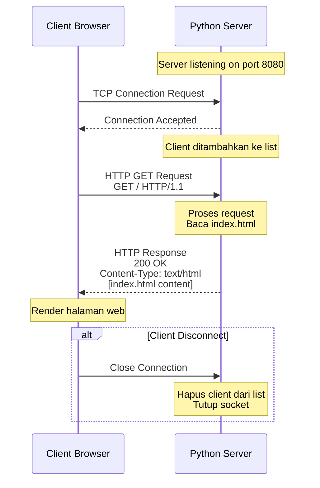
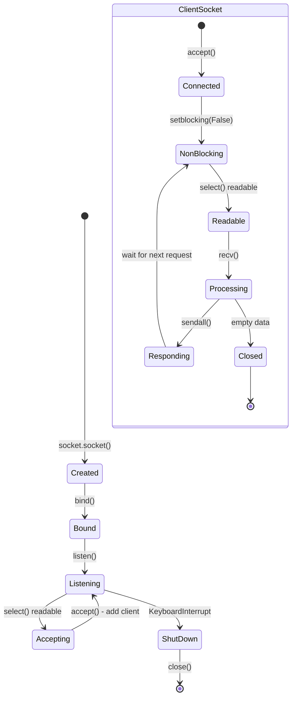

# IOCP Web Server - Python

## Deskripsi

Repository ini berisi implementasi web server asinkronus sederhana menggunakan Python. Server menggunakan teknik I/O multiplexing dengan `select.select()` untuk menangani multiple koneksi client secara efisien tanpa menggunakan threading. Proyek ini dikembangkan sebagai bagian dari praktikum Network Programming.

## Arsitektur Program

### Komponen Utama

| File | Deskripsi |
|------|-----------|
| `iocp_webserver.py` | Server utama yang menangani koneksi TCP dan HTTP request |
| `index.html` | Halaman web statis yang disajikan kepada client |

### Teknologi yang Digunakan

- **Python 3.x** - Bahasa pemrograman utama
- **Socket Programming** - Komunikasi jaringan level rendah
- **I/O Multiplexing** - Penanganan multiple koneksi dengan `select()`
- **Non-blocking I/O** - Socket dalam mode non-blocking untuk responsivitas tinggi

## Alur Kerja Program

### Diagram Alur Server



### Diagram Interaksi Client-Server



### Diagram State Socket



## Penjelasan Teknis

### I/O Multiplexing dengan select()

Server menggunakan `select.select()` untuk memonitor multiple socket secara bersamaan. Fungsi ini memblokir eksekusi hingga salah satu socket siap untuk operasi I/O.

```python
readable, _, _ = select.select(clients, [], [])
```

Keuntungan pendekatan ini:
- Tidak memerlukan threading atau multiprocessing
- Efisien untuk menangani banyak koneksi bersamaan
- Menghindari busy-waiting dengan blocking pada select()

### Non-blocking Socket

Server socket dan semua client socket dikonfigurasi dalam mode non-blocking:

```python
server_socket.setblocking(False)
client_socket.setblocking(False)
```

Hal ini memungkinkan server untuk tidak terhenti saat menunggu operasi I/O selesai.

### HTTP Response

Server mengirimkan response HTTP yang valid dengan header:
- `HTTP/1.1 200 OK` - Status code sukses
- `Content-Type: text/html` - Tipe konten HTML
- `Content-Length` - Ukuran body response

## Cara Penggunaan

### Prasyarat

- Python 3.x terinstal
- Port 8080 tersedia

### Menjalankan Server

```bash
python iocp_webserver.py
```

### Mengakses Web Page

Buka browser dan akses:
```
http://127.0.0.1:8080
```

### Menghentikan Server

Tekan `Ctrl+C` untuk menghentikan server dengan graceful shutdown.

## Struktur Response HTTP

```
HTTP/1.1 200 OK
Content-Type: text/html
Content-Length: [ukuran_file]

[isi index.html]
```

## Limitasi

- Server hanya mendukung metode GET
- Tidak ada routing - semua request akan dilayani dengan index.html
- Koneksi tidak mengimplementasikan keep-alive secara penuh
- Tidak ada penanganan error untuk file index.html yang tidak ditemukan

## Referensi

- [Python Socket Programming](https://docs.python.org/3/library/socket.html)
- [Python select Module](https://docs.python.org/3/library/select.html)
- [HTTP/1.1 Specification](https://www.rfc-editor.org/rfc/rfc2616)
